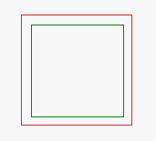
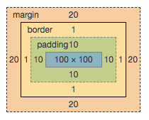
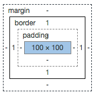

## css标准盒模型理解

思考题：
HTML结构为 div.parent > div.child，如果 div.parent 的样式为 width: 100px; padding: 10px;
那么请问 div.child 所占的宽度为多少 px ？


```
## html 
<!DOCTYPE html>
<html>
<head>
  <meta charset="utf-8">
  <title>JS Bin</title>
</head>
<body>
<div class=first>
  <div class=second>
  </div>
</div>
</body>
</html>
```

```
## css
.first {
  border: 1px solid red;
  width: 100px;
  height: 100px;
  padding: 10px;
  margin: 20px;
}

.second {
  border: 1px solid green;
  height: 100%;
  width: 100%;
}
```

结果为：
[](images/WX20180320-204352.png)

div.first盒模型
[](images/WX20180320-205625.png)

div.second盒模型
[](images/WX20180320-205715.png)


## 其他笔记
1. css href
2. 四种方式
3. ul list-style: none
4. border大法
5. clearfix: 子元素float: left,在子元素的爸爸上添加clearfix类
6.  first > second > third 必须是儿子
7. 浏览器， 默认font-size: 16
8. 防抖 提前设置padding
9. inherit 子元素自动继承父元素的font-size


一个元素的高度是由 它内部文档流元素高度决定的
文档流：内联元素从左往右 块级元素自上往下另起一行


内联元素的高度基本不可测的


```
<span>Hello</span>
{
	display: inline-block;
	width: 100px; /*  不要写高宽 */
	height: 200px; /*  不要写高宽 */
}
```
用 paddind 发多少 三角形
HTML 结构为 div.parent > div.child
如果 div.parent 的样式为
width: 1000px; padding: 100px;


css盒模型理解
